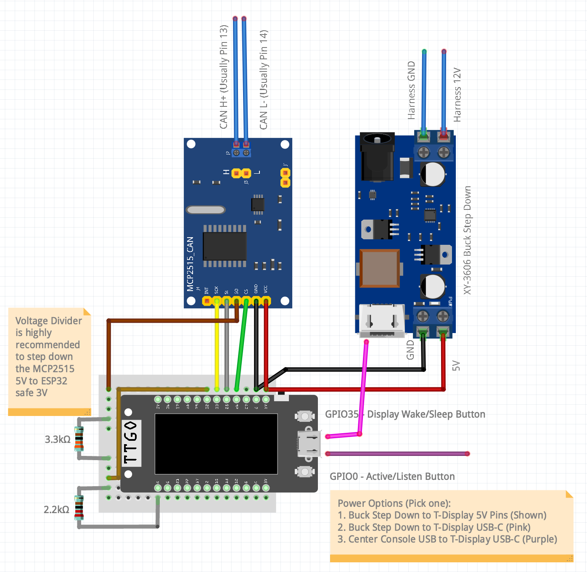

# Hardware

## Quick comparison

| Option | Cost | Connection | CAN buses | WiFi | Best for |
|--------|------|------------|-----------|------|----------|
| **Any ESP32 + MCP2515 → X179** | **~$5-7** | X179 4-wire | 1 (bus 6 = mixed) | Yes | Cheapest full-feature setup |
| M5Stack ATOM Lite + ATOMIC CAN → X179 | ~$13-15 | X179 4-wire | 1 (bus 6) | Yes | Plug & play, no soldering |
| **LILYGO T-2CAN ESP32-S3** → X179 | **~$24** | X179 4-wire (+ spare CAN2) | **2 independent** | Yes | Future-proof, dual-CAN ready |
| **LILYGO T-CAN485** → X179 | **~$15** | X179 4-wire | 1 (SN65HVD230) | Yes | SD card CAN dump, tested on Model X/S |
| **LILYGO TTGO T-Display + MCP2515** → X179 | **~$20** | X179 4-wire (+12 V→5 V buck or USB-C) | 1 (MCP2515) | Yes | On-board 1.14" ST7789 status display |
| Waveshare ESP32-S3-RS485-CAN → X179 | ~$18 | X179 4-wire | 1 (TWAI) | Yes | All-in-one board |
| Flipper Zero + Electronic Cats CAN Add-On → OBD-II | ~$234 | OBD-II plug | 1 (Party CAN) | No | If you already own a Flipper |
| Flipper Zero + generic MCP2515 → OBD-II | ~$202-205 | OBD-II wire | 1 (Party CAN) | No | Budget Flipper option |

---

## Connection points on Tesla Model 3/Y

There are two places to tap the CAN bus. **The X179 connector is
recommended** — it provides more signals and built-in 12V power.

### OBD-II (16-pin) — Tesla-specific notes

The standard automotive diagnostic port. On Tesla the location and
behavior differ by model and year:

- **2017–2018 Model 3**: no OBD-II port. Use X052 instead (see below).
- **2019+ Model 3 / 2020–April 2024 Model Y**: OBD-II J1962 port
  exists, but it is **not under the steering column** — it sits in
  the rear center console area and requires a Tesla-specific adapter
  cable (e.g., OHP, EVTV, Cybertool) to expose a standard 16-pin
  socket.
- **April 2024+ Juniper Model Y / refreshed Model 3 Highland (later
  builds)**: Tesla switched to **DoIP** (Diagnostic over IP) — the
  diagnostic port now carries 100 Mbps Ethernet, **not** CAN.

> [!CAUTION]
> Do not connect a CAN-based OBD-II adapter or scan tool to a DoIP
> port. The signal levels are incompatible and connecting a J1962-on-
> CAN device into a DoIP-only port can damage the vehicle's diagnostic
> module. If you have a 2024+ Juniper, tap X179 directly — see below.

```
    ┌──────────────────────────────┐
    │  1  2  3  4  5  6  7  8     │
    │   9 10 11 12 13 14 15 16    │
    └─────────────────────────────┘
```

| Pin | Signal | Notes |
|-----|--------|-------|
| 4 | Chassis GND | |
| 5 | Signal GND | |
| **6** | **CAN-H** | **Party CAN** |
| **14** | **CAN-L** | **Party CAN** |
| **16** | **+12V always-on** | Constant power even when car is locked |

**Bus: Party CAN only.** This carries DAS, ESP, BMS, FSD gate, nag
(EPAS), ISA chime, precondition — everything our v1.0–v2.3 used.

Limitation: Party CAN does not carry stalk signals (SCCM_rightStalk),
lighting commands (VCFRONT_lighting), or steering wheel button inputs
(STW_ACTN_RQ). Those are on Vehicle CAN.

### X052 — 2019 Model 3 (pre-facelift)

The 2019 Model 3 does **not** have the X179 connector or a standard
OBD-II port under the steering column. Instead, it uses the X052
connector, located behind the center console / passenger footwell area.

Confirmed by community tester @THER4iN (issue #21):

| X052 Pin | Signal | Notes |
|----------|--------|-------|
| **44** | **CAN-H** | CAN bus |
| **45** | **CAN-L** | CAN bus |
| **20** | **12V** | Power (no service mode errors confirmed) |
| **22** | **GND** | Ground |

Same 4-wire pattern as X179 — CAN + power. Compatible with all the
same ESP32/MCP2515 setups described below.

The 2019 Model 3 also has an **X930m** connector near the A-pillar.
Pinout not yet confirmed — if you test it, please report in an issue.

### X179 — behind the rear center console (2021+ Model 3/Y)

Tesla's own service/diagnostic connector. Requires removing a trim
panel behind the rear armrest. Two versions exist:

#### X179 20-pin (2021–2023 Model 3/Y)

```
     +---------------------------------+
     |  1   2   3   4   5   6   7      |
     |  8   9  10  11  12  13  14      |
     | 15  16  17  18  19  20          |
     +---------------------------------+
```

| Pin | Signal | CAN bus |
|-----|--------|---------|
| **1** | **+12V** | Power |
| 2 | CAN-H | Bus 4 (diagnostic/forwarded) |
| 3 | CAN-L | Bus 4 |
| 9 | CAN-H | Bus 2 (Vehicle CAN) |
| 10 | CAN-L | Bus 2 |
| **13** | **CAN-H** | **Bus 6 (Body/Left — Gateway mixed forwarding)** |
| **14** | **CAN-L** | **Bus 6** |
| **15** | **+12V** | Power (2mm² wire, alternate to pin 1) |
| 18 | CAN-H | Bus 3 (Chassis CAN — EPAS/brake) |
| 19 | CAN-L | Bus 3 |
| **20** | **GND** | Ground |

**4 separate CAN bus pairs** on one connector. Pin 13/14 (bus 6) is
what aftermarket products (Feifan Commander, enhauto, etc.) connect to.

#### 26-pin rear connector — two variants

The 26-pin rear connector ships in two electrical configurations
depending on production date. **They are not interchangeable.**

> [!NOTE]
> The connector name is unsettled. The 20-pin variant is documented as
> X179 in community sources, but Tesla service documentation may use a
> different identifier for the 26-pin. If you find the official name
> in a Tesla service doc, please open an issue with the reference and
> we will update.

##### Pre-April 2024 builds (CAN)

Confirmed on community testing of 2021–2023 Model 3/Y and early 2024
Highland / Juniper builds.

| Pin | Signal | Notes |
|-----|--------|-------|
| **13** | **CAN-H** | Bus 6 (Gateway-forwarded) |
| **14** | **CAN-L** | Bus 6 |
| **15** | **+12V** | Power (red wire, 2mm²) |
| 18 | CAN-H | Vehicle CAN (blue wire) |
| 19 | CAN-L | Vehicle CAN (yellow wire) |
| **26** | **GND** | Ground (black wire, 2mm²) |

##### Post-April 2024 builds (mixed DoIP / CAN)

> [!CAUTION]
> Tesla migrated several pin pairs from CAN to **DoIP (100 Mbps
> Ethernet)** in April 2024 — coinciding with the EU's OBD compliance
> deadline. This migration appears to apply at least to EU-region
> builds and likely beyond, but the exact scope is **not yet pinned
> down** (see SOP variants below). **Do not assume your 26-pin
> follows the pre-April 2024 layout — oscilloscope-verify before
> powering up a transceiver.**

The classification axis is April 2024 production date and region, **not**
Juniper-or-not. A pre-Juniper EU-build Model Y from the same window
shows the same DoIP migration as Juniper builds.

Confirmed by @0n3-70uch via oscilloscope measurements on a Berlin-built
EU Model Y (pre-Juniper, post-April-2024 production) running 2026.14.3
(issue [#52](https://github.com/hypery11/flipper-tesla-fsd/issues/52)):

| Pin | Signal on this car |
|-----|--------------------|
| 9 / 10 | DoIP (Ethernet) — **not** CAN |
| 12 / 13 | DoIP (Ethernet) — **not** CAN |
| **18 / 19** | **Vehicle CAN — only working CAN pair** |
| 15 | +12V (unchanged) |
| 26 | GND (unchanged) |

This is a **single empirical data point** and may not generalise to
every post-April-2024 build. @TianzeWang notes (issue [#52](https://github.com/hypery11/flipper-tesla-fsd/issues/52))
that Tesla's [Model Y Electrical Reference](https://service.tesla.com/docs/ModelY/ElectricalReference/)
distinguishes between **Berlin Juniper (SOP8)** and **Shanghai Juniper
(SOP9)** — pin maps may differ further by SOP variant. Until a
broader sweep is published, the safe recommendation on any 2024+
build is:

1. **Oscilloscope-verify** every pair before connecting a transceiver.
2. If the 120 Ω differential-signal check fails on pin 13/14, the
   pair is likely DoIP — try pin 18/19 instead.
3. The +12V (pin 15) and GND (pin 26) appear stable across SOPs.

### Why X179 Pin 13/14 is the best single connection point (pre-April 2024 only)

The Gateway forwards signals from **multiple internal CAN buses** onto
bus 6 (pin 13/14). Community testing confirms that the following
"Party CAN" signals are visible on X179 pin 13/14:

- `0x3FD` UI_autopilotControl (FSD gate)
- `0x370` EPAS3S_sysStatus (nag killer)
- `0x132` BMS_hvBusStatus (battery voltage/current)
- `0x292` BMS_socStatus (state of charge)
- `0x312` BMS_thermalStatus (battery temp)
- `0x399` ISA speed limit
- `0x39B` DAS_status (AP state, blind spot)
- `0x2B9` DAS_control (ACC state)

And these "Vehicle CAN" signals are also writable on bus 6:

- `0x229` SCCM_rightStalk (gear shift, park)
- `0x3F5` VCFRONT_lighting (hazard, wiper)
- `0x249` SCCM_leftStalk (high beam, turn signal)

**One bus, one connection, reads and writes almost everything.**

This is how the 非凡指揮官 (Feifan Commander, 69K+ sales in China)
achieves its full feature set with just 4 wires:

```
X179 Pin 13 → CAN-H ──┐
X179 Pin 14 → CAN-L ──┤── CAN module (MCP2515 / TWAI)
X179 Pin 15 → 12V ────┤── buck converter → 3.3V/5V
X179 Pin 20 → GND ────┘   (26-pin: use Pin 26 for GND)
```

### X179 — 20-pin (Model S / Model X with HW3 + MCU2)

Pre-Plaid HW3 Model S and Model X cars (MCU2 generation) expose their
own X179 connector behind the rear centre console. It is a 20-position
shell but with a different physical layout and a different bus
assignment than the Model 3/Y X179 above — top row is 11 cavities
numbered right-to-left from 1 to 11, bottom row is 9 cavities numbered
right-to-left from 12 to 20.

**View: female connector looking in from the rear (i.e. from the wire
side / pin-entry side, not the mating face).** If you flip the
connector around to look at the mating face the layout mirrors
left/right, so always confirm cavity numbers against the moulded
numbers on the housing before crimping anything.

```
     ╭───────────────────────────────────────────────╮
     │  11  10   9   8   7   6   5   4   3   2   1   │
     │  20  19  18      17  16  15       14  13  12  │
     ╰───────────────────────────────────────────────╯
```

Full pinout (the four pins this firmware uses are bolded):

| PIN | Signal | Notes |
| :---: | :---: | :--- |
| **1** | **+12 V** | **Supply for the ESP32 / buck converter** |
| 2   | CAN+ BFT | Ultrasonics, falcon-wing doors, liftgate |
| 3   | CAN- BFT | "   |
| 4   | CAN+ TH | Cabin HVAC, pack heat-pump, powertrain cooling — separated from safety-critical traffic |
| 5   | CAN- TH | "   |
| 6   | —   | —   |
| 7   | CNF+ | Falcon sensors (ultrasonic, pinch, etc.) |
| 8   | CNF- | "   |
| 9   | CAN+ BD | Seat / door control |
| 10  | CAN- BD | "   |
| 11  | —   | —   |
| 12  | —   | —   |
| **13** | **CAN+ CH** | **ABS, EPAS, ESP, electric park brake — carries the 0x370 EPAS frame the nag-killer modifies** |
| **14** | **CAN- CH** | **"** |
| 15  | —   | —   |
| 16  | —   | —   |
| 17  | —   | —   |
| 18  | CAN+ PT | DI front, THC, APE (Autopilot ECU), charge-port logic — backbone for motor control, HV battery management, charging, regen braking |
| 19  | CAN- PT | "   |
| **20** | **GND** | **Chassis ground** |
For Tesla FSD Unlock the four pins you need are **1, 13, 14, 20**:

```
X179 Pin 1  → +12 V ─┐
X179 Pin 13 → CAN-H ──┤── CAN module (MCP2515 / TWAI)
X179 Pin 14 → CAN-L ──┤── buck converter → 5 V (or USB-C as in Setup D Option 2)
X179 Pin 20 → GND   ──┘
```

Pins 13/14 land on **Chassis CAN**, which is where EPAS3P_sysStatus
(0x370 — the nag-killer target) lives on this generation. The Power
Train bus on pins 18/19 carries APE / autopilot traffic but is not
required for the nag-killer-only use case — most Model S/X HW3 owners
tap pins 13/14 only.

---

## Recommended setups

### Setup A — Cheapest full-feature (~$6)

Any ESP32 dev board + any MCP2515 CAN module from Aliexpress.

| Component | Price |
|-----------|-------|
| ESP32-C3-SuperMini or ESP32-DevKitC | ~$3-4 |
| MCP2515 CAN module (TJA1050 transceiver) | ~$1.50-3 |
| X179 pigtail cable (4-wire, or DIY from connector) | ~$3-5 |
| **Total** | **~$8-12** |

Wire: X179 CAN-H/CAN-L → MCP2515 module CAN-H/CAN-L. X179 12V → buck
converter → ESP32 VIN. X179 GND → common GND.

Build with `pio run -e esp32-mcp2515`, adjust pin config in
`esp32/.firmware/config.h`.

### Setup B — M5Stack plug & play (~$20)

| Component | Price |
|-----------|-------|
| [M5Stack ATOM Lite](https://shop.m5stack.com/products/atom-lite-esp32-development-kit) | ~$7.50 |
| [ATOMIC CAN Base (CA-IS3050G)](https://shop.m5stack.com/products/atomic-can-base) | ~$5-7 |
| X179 pigtail cable (4-wire) | ~$3-5 |
| **Total** | **~$16-20** |

ATOMIC CAN Base snaps onto the ATOM Lite. Solder X179 CAN-H/CAN-L to
the screw terminals, 12V to VIN, GND to GND. Build: `pio run -e esp32-twai`.

### Setup C — LILYGO T-2CAN dual-CAN (~$33)

| Component | Price |
|-----------|-------|
| [LILYGO T-2CAN ESP32-S3](https://lilygo.cc/products/t-2can) | ~$24 |
| X179 pigtail cable (4-wire) | ~$3-5 |
| **Total** | **~$27-29** |

The T-2CAN has **dual isolated MCP2515 controllers**, dual screw
terminals, 12–24V input, WiFi, BLE, QWIIC, and USB-C. Connect X179
to CAN1 screw terminal. CAN2 stays free for future use (e.g., OBD-II
Party CAN for redundancy, or a second X179 bus pair).

This is the recommended board for anyone who wants headroom for
dual-bus features in a future firmware update.

### Setup D — LILYGO TTGO T-Display + MCP2515 (~$20)

A multi-board build (T-Display + MCP2515 module + optional XY-3606 buck
converter) that runs the same firmware as every other variant **and
adds a 1.14" colour ST7789 LCD on the T-Display itself** so you can see
RX/TX/FPS/NAG status without opening a phone. In its current bare-board
form there are several wires running between the boards — putting them
in a 3D-printed case is left as an exercise.



| Component | Price |
|-----------|-------|
| [LILYGO TTGO T-Display ESP32 (1.14" ST7789, USB-C)](https://lilygo.cc/products/lilygo%C2%AE-ttgo-t-display-1-14-inch-lcd-esp32-control-board) | ~$10-12 |
| Generic MCP2515 + TJA1050 module (8 MHz crystal, 5 V) | ~$2-4 |
| 2× ¼ W resistors for MISO divider (1× 2.2 kΩ + 1× 3.3 kΩ, see below) | <$0.10 |
| X179 pigtail cable (4-wire) | ~$3-5 |
| Power: either an [XY-3606 12 V → 5 V buck converter](https://www.aliexpress.com/wholesale-xy3606.html) **or** a USB-C cable to the centre-console USB port | ~$2 / ~$3 |
| **Total** | **~$17-26** |

#### Pin map

The T-Display LCD owns the board's default VSPI (TFT_CS=5, TFT_SCLK=18,
TFT_MOSI=19, TFT_DC=16, TFT_RST=23, TFT_BL=4), so the MCP2515 lives on
HSPI on the right-hand pin header:

| MCP2515 pin | T-Display GPIO | Notes |
|-------------|----------------|-------|
| CS | 26 | |
| SCK | 33 | |
| **SO (MISO)** | **32** | **Through 5 V → 3.3 V divider** — see below |
| SI (MOSI) | 25 | 3.3 V out from the ESP32 — MCP2515 input is 5 V tolerant, no divider |
| INT | not connected | Polled, no interrupt wire needed |
| VCC | T-Display **5V** pin | Required for TJA1050 transceiver to drive the differential CAN pair correctly |
| GND | T-Display GND | Common ground with the X179/buck/USB-C supply |

Build with `pio run -e ttgo-tdisplay -t upload`. On first boot the LCD
prints `Tesla FSD Unlock` then a live status page (HW version, mode,
RX/TX counters, FPS, NAG indicator).

#### On-board buttons

The T-Display has two tactile push-buttons on the front face, one on
each side of the USB-C connector (between the LCD and the USB port):

| Button | GPIO | Default action | Extra |
|--------|------|----------------|-------|
| **Left** (GPIO35) | `PIN_BUTTON2` | Single press: **toggle display on/off** (sleep/wake the LCD; CAN processing keeps running) | — |
| **Right** (GPIO0, also the Boot button) | `PIN_BUTTON` | Single press: **toggle Listen-Only ↔ Active** (i.e. enable/disable bus TX) | Double-press: toggle BMS serial output. Long-press 3 s: toggle NAG killer. Hold 5 s during the 20 s post-boot window: factory-reset NVS. |

The on-screen `Mode:` text (cyan `LISTEN` ↔ green `ACTIVE`) and the
`NAG` indicator next to it follow the right button immediately.

#### Powering the T-Display in the car

Pick **one** of the two options below — never wire both at the same
time, the T-Display has no power-path arbitration between the USB-C and
the 5 V pin.

**Option 1 — XY-3606 buck converter from X179 12 V**

Permanent install, fully integrated into the X179 harness. The XY-3606
is a tiny adjustable buck regulator that accepts 5 – 36 V in and is set
once with the on-board trim pot to output 5.0 V at up to ~2 A.

```
                                ┌──────────── 5V → T-Display "5V" pin
X179 Pin 1  (+12 V) ─── IN+ ────┤ XY-3606
                                │ buck
X179 Pin 20 (GND)   ─── IN- ────┤  (set
                                │  Vout
                                │  = 5.0 V)
                                └──────────── GND → T-Display GND
                                                  + MCP2515 GND
X179 Pin 13 (CAN-H) ──────────────────────── MCP2515 CAN-H
X179 Pin 14 (CAN-L) ──────────────────────── MCP2515 CAN-L
```

Set the buck output to 5.0 V **before** wiring it to the T-Display
(turn the multi-turn pot while measuring the OUT terminals with a
multimeter). The factory default is often 12 V → instant magic smoke
on the ESP32 if you skip this step.

**Option 2 — USB-C cable from the centre console USB port**

Easiest temporary install — no soldering on the power rail at all. Run
a USB-C cable from a centre console USB port to the T-Display's USB-C
connector. The T-Display's CH340 USB-serial chip handles 5 V input and
powers both the ESP32 and (via the 5V pin) the MCP2515 module. The USB
cable also carries ground, so no separate GND wire to X179 is needed.

```
Centre console USB-C ────────── T-Display USB-C
                                       │
                                       └── 5V pin ── MCP2515 VCC
                                       └── GND    ── MCP2515 GND
X179 Pin 13 (CAN-H) ─────────────────────────────── MCP2515 CAN-H
X179 Pin 14 (CAN-L) ─────────────────────────────── MCP2515 CAN-L
```

Note: the centre console USB ports power down when the car sleeps, so
the T-Display will power-cycle on every wake — this is fine for daily
driving but loses the in-RAM RX/TX counters between trips.

### Setup E — Flipper Zero + CAN Add-On (~$210)

The original reference platform. Connect to **OBD-II** (not X179) using
the Electronic Cats CAN Bus Add-On or a generic MCP2515 module.

| Component | Price |
|-----------|-------|
| [Flipper Zero](https://flipper.net/) | $199 |
| [Electronic Cats CAN Bus Add-On](https://electroniccats.com/store/flipper-addon-canbus/) | $35 |
| OBD-II pigtail cable | ~$5-10 |
| **Total** | **~$239-244** |

OBD-II wiring (Party CAN only):

| OBD-II pin | Wire | Add-On terminal |
|------------|------|-----------------|
| Pin 6 | CAN-H | CAN-H |
| Pin 14 | CAN-L | CAN-L |
| Pin 4/5 | GND | GND |

The Flipper can also be wired to X179 instead of OBD-II for bus 6
access, but the cable run from the rear console to the Flipper is long.

### MCP2515 MISO 5V to 3.3V voltage divider

Almost every commodity MCP2515 module sold on AliExpress / Amazon
(MCP2515 + TJA1050 daughterboard, 8 MHz crystal) is hard-wired for
**5 V VCC** because the TJA1050 transceiver needs 5 V to swing the
differential CAN pair. The MCP2515 controller therefore runs from 5 V
too, and its **MISO output drives a 5 V high level**.

ESP32 GPIOs are **3.3 V tolerant only**. Feeding a 5 V signal into a
3.3 V GPIO clamps it through the SoC's ESD diodes — best case it
shortens the ESP32's life, worst case it latches up and bricks the
chip. Three options, in order of how strongly we recommend them:

1. **Resistor divider** (~$0.05, recommended) — works on any module.
2. **Bidirectional level shifter board** (e.g. TXS0108E, ~$1) — useful
   if you also want to wire the INT pin or want a tidier build.
3. **3.3 V-only MCP2515 module** (e.g. NiRen, JOY-iT SBC-CAN01 with
   TJA1051T/3) — no divider needed but harder to source.

Only **MISO** needs the divider. MOSI, SCK and CS are driven by the
ESP32 at 3.3 V and the MCP2515 reads them just fine (its input
threshold is well below 3.3 V).

#### Two-resistor divider on MISO

Use any two resistors whose ratio is roughly 0.65 — i.e. R2 / (R1+R2)
≈ 3.3 / 5.0. Common values that work:

| R1 (top) | R2 (bottom) | Output (5 V in) | Notes |
|----------|-------------|------------------|-------|
| **2.2 kΩ** | **3.3 kΩ** | **3.00 V** | **Recommended** — canonical "Arduino → 3.3 V" pair, in every starter kit |
| 2 kΩ | 3.3 kΩ | 3.11 V | Equivalent — use if you have 2 kΩ but not 2.2 kΩ |
| 1 kΩ | 2 kΩ | 3.33 V | Equivalent, draws ~1.7 mA — both values in nearly every assortment kit |
| 10 kΩ | 22 kΩ | 3.44 V | **Avoid** — too high impedance for 8 MHz SPI, edges round off |

Wire it like this between the MCP2515 SO pin and the ESP32 MISO GPIO:

```
                R1 = 2.2 kΩ
MCP2515 SO ─────/\/\/\─────┬──── ESP32 MISO (3.3 V max)
                           │
                           /
                           \  R2 = 3.3 kΩ
                           /
                           \
                           │
                          GND
```

Build it on a tiny scrap of perfboard inline with the SO wire, or
solder it directly across the MCP2515 module's SO header pin. Heat-
shrink the joint and you're done.

#### Verification

Before powering the ESP32 with the MCP2515 connected, with **only** the
MCP2515 module powered from 5 V, idle the SPI bus and probe the
divider's output with a multimeter:

- MCP2515 SO pin (before divider): should idle high at ~4.7–5.0 V
- ESP32 MISO pin (after divider): should be 3.0–3.4 V

If the divider output is below 2.5 V or above 3.6 V, double-check the
resistor values and the wiring direction (R1 on the MCP2515 side, R2
to GND).

### Termination resistor

Tesla's CAN buses are already terminated. **Do not add a second 120 Ω
terminator.** Most aftermarket CAN modules ship with the termination
resistor enabled — disable it before connecting to the car.

- **Electronic Cats Add-On v0.1**: open the `J1 / TERM` solder jumper
- **Electronic Cats Add-On v0.2+**: ships disabled, no action needed
- **Generic MCP2515 modules**: find and remove `R4` or `J1`
- **M5Stack ATOMIC CAN Base**: no termination by default
- **LILYGO T-2CAN**: check documentation

Verify: measure resistance between CAN-H and CAN-L with the module
disconnected from the car. ~120 Ω = good (terminator off, car provides
its own). ~60 Ω = your module's terminator is on, disable it.

---

## Power and sleep

### OBD-II Pin 16 — always on

OBD-II Pin 16 supplies +12V **even when the car is locked and
sleeping**. If your module draws 50 mA at 12V (typical ESP32 idle),
that's 0.6W continuous → will drain the 12V battery over days.

### X179 Pin 1/15 — behavior varies

On some Model 3/Y builds, X179 12V is gated by the car's wake state.
On others it's always-on like OBD-II. Test with a multimeter before
relying on it.

### Deep sleep (recommended for permanent install)

For any module that stays plugged in:

1. Monitor CAN bus traffic. If no frames seen for 5 minutes → the car
   is asleep.
2. Enter ESP32 deep sleep (~10 µA draw, negligible battery impact).
3. Wake on MCP2515 INT pin (frame received = car woke up) or on a
   timer (check every 60 seconds).

This is how commercial products (Feifan Commander, enhauto Commander)
handle permanent installation without draining the 12V battery.

---

## What about other CAN modules?

Anything with an MCP2515-over-SPI interface or an ESP32 TWAI peripheral
works with a config change. Community-confirmed boards:

- Joy-IT SBC-CAN01 (MCP2515) — Europe source
- Waveshare RS485-CAN-HAT (MCP2515) — re-wire jumpers for Flipper
- Waveshare ESP32-S3-RS485-CAN — TWAI driver, all-in-one
- Adafruit RP2040 / Feather M4 CAN — see upstream
  [Karolynaz/waymo-fsd-can-mod](https://github.com/Karolynaz/waymo-fsd-can-mod)

If you get a non-listed board working, open a PR with the pin map.
