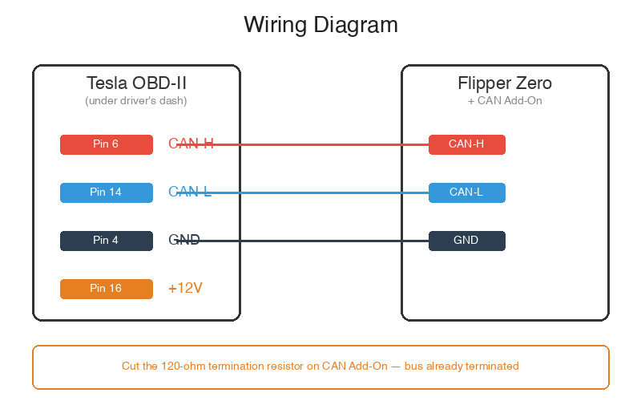

[English](README.md) | [繁體中文](README_zh-TW.md)

# Tesla FSD 解鎖 — Flipper Zero

[](https://github.com/hypery11/flipper-tesla-fsd/stargazers)
[](https://github.com/hypery11/flipper-tesla-fsd/network)
[](https://github.com/hypery11/flipper-tesla-fsd/releases)
[](LICENSE)

用 Flipper Zero 解鎖 Tesla FSD。不用訂閱、不用電腦，插上 OBD-II 就能跑。

<p align="center">
  &nbsp;&nbsp;&nbsp;
  
</p>

---

## 功能

- 自動偵測 HW3/HW4（從 `GTW_carConfig` `0x398` 讀取），也可手動強制指定
- 透過修改 `UI_autopilotControl`（`0x3FD`）的 bit 來啟用 FSD
- Nag 抑制（消除方向盤握手提醒）
- 速度檔位預設最快，自動從跟車距離撥桿同步
- Flipper 螢幕即時顯示狀態

### 支援硬體

| Tesla HW | 修改的 Bits | 速度檔位 |
|----------|------------|----------|
| HW3 | bit46 | 3 段（0-2） |
| HW4（FSD V14+） | bit46 + bit60、bit47 | 5 段（0-4） |

HW4 車輛韌體版本 **2026.2.3 以前**請使用 HW3 模式。詳見[相容性](#相容性)。

---

## 硬體需求

| 元件 | 說明 | 價格 |
|------|------|------|
| [Flipper Zero](https://flipper.net/) | 本體 | ~$170 |
| [Electronic Cats CAN Bus Add-On](https://electroniccats.com/store/flipper-addon-canbus/) | MCP2515 CAN 收發器模組 | ~$30 |
| OBD-II 線或 T-tap | 接到 Tesla 的 Party CAN bus | ~$10 |

### 接線

<p align="center">
  
</p>

> **重要：** 把 CAN Add-On 板上的 120 歐姆終端電阻切斷或停用。車上的 CAN bus 已經有自己的終端電阻，多一個會造成通訊錯誤。

替代接點：後座中控台內的 **X179 診斷接頭**（20-pin 版 Pin 13/14 = CAN-H/L；26-pin 版 Pin 18/19）。

---

## 安裝

### 方法一：下載編譯好的 FAP

1. 到 [Releases](https://github.com/hypery11/flipper-tesla-fsd/releases) 頁面
2. 下載 `tesla_fsd.fap`
3. 複製到 Flipper 的 SD 卡：`SD Card/apps/GPIO/tesla_fsd.fap`

### 方法二：自行編譯

```bash
# Clone Flipper Zero 韌體
git clone --recursive https://github.com/flipperdevices/flipperzero-firmware.git
cd flipperzero-firmware

# Clone 本 app 到 applications_user
git clone https://github.com/hypery11/flipper-tesla-fsd.git applications_user/tesla_fsd

# 編譯
./fbt fap_tesla_fsd

# 燒錄到 Flipper
./fbt launch app=tesla_fsd
```

---

## 使用方式

1. 把 CAN Add-On 插上 Flipper Zero
2. 用 CAN-H/CAN-L 接到車上 OBD-II 口
3. 開啟 app：`Apps > GPIO > Tesla FSD`
4. 選 **「Auto Detect & Start」**（或手動選 HW3/HW4）
5. 等待偵測（最多 8 秒）
6. App 自動開始修改 CAN frame

### 螢幕顯示

```
  Tesla FSD Active
  HW: HW4    Profile: 4/4
  FSD: ON    Nag: OFF
  Frames modified: 12345
       [BACK] to stop
```

### 啟動觸發條件

車上 Autopilot 設定中的 **「交通號誌與停車標誌控制」** 開啟時，app 才會開始修改 frame。這個旗標是 CAN frame 裡的判斷依據。

---

## 相容性

| 車型 | HW 版本 | 韌體 | 模式 | 狀態 |
|------|--------|------|------|------|
| Model 3/Y（2019-2023） | HW3 | 任何 | HW3 | 支援 |
| Model 3/Y（2023+） | HW4 | < 2026.2.3 | **HW3** | 支援 |
| Model 3/Y（2023+） | HW4 | >= 2026.2.3 | HW4 | 支援 |
| Model S/X（2021+） | HW4 | >= 2026.2.3 | HW4 | 支援 |
| Model S/X（2016-2019） | HW1/HW2 | 任何 | Legacy | **徵求測試者** |

### HW1/HW2 Legacy 支援 — 徵求志願者

舊款 Model S/X（2016-2019）使用 Mobileye 架構，CAN ID 完全不同。Autopilot 控制 frame 在 `0x3EE`（1006）而非 `0x3FD`（1021），bit 排列也不一樣。

邏輯已經有文件記錄（參考 [CanFeather LegacyHandler](https://gitlab.com/Starmixcraft/tesla-fsd-can-mod)），但我們需要有 HW1/HW2 車的人幫忙驗證才能上線。

**如果你有 2016-2019 Model S/X 且有 FSD，想幫忙的話：**

1. Flipper + CAN Add-On 接上 OBD-II
2. 開啟內建的 CAN sniffer app
3. 確認 CAN ID `0x3EE`（1006）有出現在 bus 上
4. 擷取幾個 frame，貼到 [issue #1](https://github.com/hypery11/flipper-tesla-fsd/issues/1)

驗證通過後，Legacy 支援很快就能加上。

---

## 運作原理

在 Party CAN（Bus 0）上做單 bus 的讀取-修改-重發。不需要 MITM，不用接第二條 bus。

1. ECU 在 Bus 0 上發出 `UI_autopilotControl`（`0x3FD`）
2. Flipper 收到，改掉 FSD 啟用 bit
3. Flipper 重發修改版 — 接收端採用最新的 frame

### 使用的 CAN ID

| CAN ID | 名稱 | 用途 |
|--------|------|------|
| `0x398` | `GTW_carConfig` | HW 偵測（`GTW_dasHw` byte0 bit6-7） |
| `0x3F8` | Follow Distance | 速度檔位來源（byte5 bit5-7） |
| `0x3FD` | `UI_autopilotControl` | FSD 解鎖目標（mux 0/1/2） |

---

## 常見問題

**拔掉之後 FSD 還會維持嗎？**
不會。這是即時 frame 修改，拔掉就恢復原樣。

**會不會把車搞壞？**
只動 UI 設定 frame，不碰煞車、轉向、動力系統。但風險自負。

**一定要 CAN Add-On 嗎？**
對。Flipper 沒有內建 CAN bus，你需要 Electronic Cats 的板子或任何 MCP2515 模組接在 GPIO 上。

---

## 致謝

- [commaai/opendbc](https://github.com/commaai/opendbc) — Tesla CAN 訊號資料庫
- [ElectronicCats/flipper-MCP2515-CANBUS](https://github.com/ElectronicCats/flipper-MCP2515-CANBUS) — Flipper 用 MCP2515 驅動
- [Starmixcraft/tesla-fsd-can-mod](https://gitlab.com/Starmixcraft/tesla-fsd-can-mod) — 原始 CanFeather FSD 研究

## 授權

GPL-3.0

## 免責聲明

僅供教育與研究用途。改裝車輛系統可能導致保固失效，也可能違反當地法規。使用者需自行承擔所有責任與風險。
